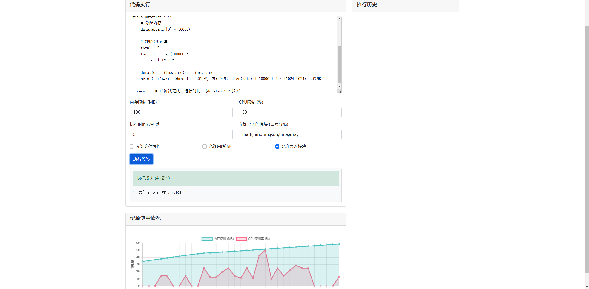

# Open Interpreter 安全沙箱

## 项目概述

Open Interpreter 安全沙箱是一个专为 Open Interpreter 框架设计的代码执行环境，提供了安全、可控的 Python 代码执行机制。该沙箱通过资源限制、访问控制和安全日志功能，确保代码执行不会危害系统安全或消耗过多资源。



## 核心功能

- **资源限制**：监控并限制内存使用、CPU使用率和执行时间
- **访问控制**：限制文件系统访问、网络操作和模块导入
- **安全日志**：详细记录代码执行过程和资源使用情况
- **Web界面**：可视化代码执行状态和资源使用情况
- **Open Interpreter集成**：无缝集成到Open Interpreter框架

## 安装指南

### 先决条件

- Python 3.10 或更高版本
- Windows、macOS 或 Linux 操作系统

### 步骤

1. **克隆仓库**

```bash
git clone https://github.com/yourusername/interpreter-sandbox.git
cd interpreter-sandbox
```

2. **安装依赖**

```bash
pip install -r requirements.txt
```

3. **开发模式安装**

```bash
pip install -e .
```

## 使用方法

### 基础使用

```python
from sandbox.core.sandbox import Sandbox
from sandbox.config.settings import SandboxSettings

# 创建沙箱实例
sandbox = Sandbox(SandboxSettings(
    max_memory_mb=100,
    max_execution_time=5,
    allowed_modules=['math', 'random']
))

# 执行代码
result = sandbox.execute("""
x = 1 + 1
__result__ = x
""")

print(f"执行结果: {result}")
```

### 使用Web界面

1. 启动Web服务

```bash
python src/sandbox/web/app.py
```

2. 在浏览器中访问: http://localhost:5000

3. 在代码编辑器中输入代码并执行

### 与Open Interpreter集成

```python
from sandbox.integration.interpreter import InterpreterSandbox
from sandbox.config.settings import SandboxSettings
import os

# 设置环境变量
os.environ['INTERPRETER_API_BASE'] = "您的API基础URL"
os.environ['INTERPRETER_MODEL'] = "您的模型名称"
os.environ['INTERPRETER_API_KEY'] = "您的API密钥"

# 创建沙箱
sandbox = InterpreterSandbox(SandboxSettings(
    max_memory_mb=100,
    max_execution_time=30,
    allowed_modules=['math', 'pandas', 'numpy']
))

# 执行聊天
response = sandbox.chat("请计算1+1等于多少")
print(response)

# 清理资源
sandbox.cleanup()
```

## 配置选项

沙箱通过 `SandboxSettings` 类进行配置，主要设置项包括：

| 参数 | 描述 | 默认值 |
| --- | --- | --- |
| max_memory_mb | 最大内存使用限制(MB) | 100 |
| max_cpu_percent | 最大CPU使用率(%) | 50 |
| max_execution_time | 最大执行时间(秒) | 5 |
| allow_file_operations | 是否允许文件操作 | False |
| network_access | 是否允许网络访问 | False |
| allow_imports | 是否允许导入模块 | True |
| allowed_modules | 允许导入的模块列表 | ['math', 'random'] |
| allowed_directories | 允许访问的目录列表 | [] |

## 项目结构

```
project-root/
├── src/
│   └── sandbox/
│       ├── __init__.py
│       ├── exceptions.py              # 异常定义
│       ├── config/                    # 配置模块
│       │   ├── __init__.py
│       │   └── settings.py            # 设置类定义
│       ├── core/                      # 核心功能
│       │   ├── __init__.py
│       │   └── sandbox.py             # 沙箱主类
│       ├── integration/               # 集成模块
│       │   ├── __init__.py
│       │   └── interpreter.py         # Open Interpreter集成
│       ├── logging/                   # 日志模块
│       │   ├── __init__.py
│       │   └── security_logger.py     # 安全日志记录
│       ├── web/                       # Web界面
│       │   ├── __init__.py
│       │   ├── app.py                 # Flask应用
│       │   └── templates/             # HTML模板
│       │       ├── index.html
│       │       └── detail.html
│       └── docker/                    # Docker支持
│           ├── __init__.py
│           ├── manager.py             # Docker容器管理
│           └── executor.py            # Docker内执行器
├── examples/                          # 使用示例
├── tests/                             # 测试用例
├── logs/                              # 日志目录
├── setup.py                           # 安装脚本
└── requirements.txt                   # 依赖项
```

## 安全性考虑

尽管本沙箱提供了多层安全防护，但它**不是**一个完全安全的环境，不能作为隔离恶意代码的唯一措施。主要限制包括：

- **非完全隔离**：沙箱在同一进程中执行代码，无法防止某些系统调用
- **资源监控延迟**：极端情况下，代码可能在被终止前短暂超出资源限制
- **权限提升风险**：特定情况下可能存在权限提升漏洞

为增强安全性，建议：
- 使用Docker容器化功能进一步隔离执行环境
- 限制允许导入的模块范围
- 禁用不必要的文件和网络访问

## 测试

运行单元测试：

```bash
python -m pytest tests/
```

## 常见问题

1. **为什么我的代码未能执行？**
   - 检查代码是否包含 `__result__` 变量，这是沙箱获取执行结果的方式
   - 确认您尝试导入的模块是否在允许列表中

2. **如何增加内存限制？**
   - 在创建 `SandboxSettings` 实例时设置 `max_memory_mb` 参数

3. **为什么Web UI中图表不显示？**
   - 确保代码执行时间足够长，以便收集足够的监控数据点
   - 检查浏览器控制台是否有错误

## 贡献指南

欢迎对本项目提供贡献！

1. Fork本仓库
2. 创建您的特性分支 (`git checkout -b feature/amazing-feature`)
3. 提交您的更改 (`git commit -m 'Add some amazing feature'`)
4. 推送到分支 (`git push origin feature/amazing-feature`)
5. 开启一个Pull Request

## 许可证

本项目采用MIT许可证 - 详情请参阅 [LICENSE](LICENSE) 文件

## 联系方式

如有任何问题或建议，请通过项目问题跟踪器提交

## 致谢

感谢所有对本项目做出贡献的开发者！

**安全提示**: 运行任何来源不明的代码都存在潜在风险。本沙箱提供了基本的安全保障，但不应被视为解决所有安全问题的完整解决方案。
